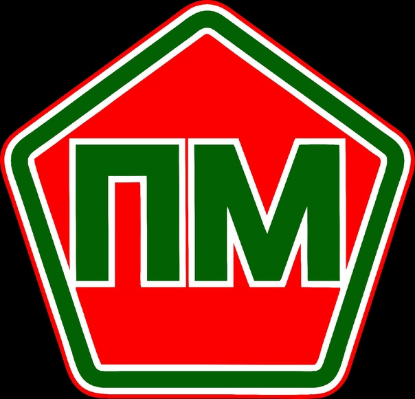
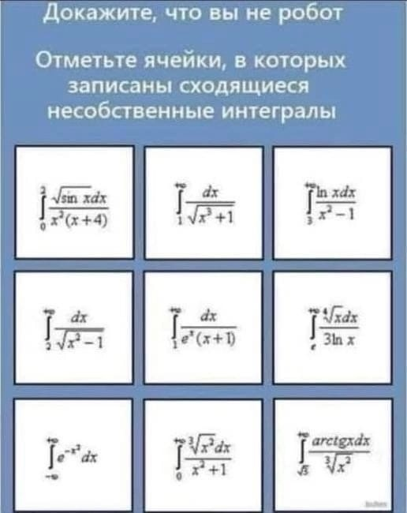

# Бот 
Бот в Телеграме – специальный аккаунт, который автоматически обрабатывает и отправляет сообщения. Пользователи Телеграма могут общаться с ботами сообщениями по принципу «вопрос-ответ».

# PmGosBot


Данный бот написан на python, использует библиотеки telebot и sqlite3py.

В его функционал входит подготовка студентов ПМ к государственным экзаменам по окончанию учебного пути. Бот имеет несколько таблиц баз данных, которые содержат вопросы
по категориям - "Диффуры" и "Интегралы" в каждой категории имеются вопросы, которые бот предложит выбрать путем ввода номера соответствующей задачки и будет терпеливо ждать ответ 
после чего может начислить балл за верный ответ, или же предложить продемонстрировать пошаговое решение при помощи wolfram alfa.

Также бот ведет учет баллов и поздаравит вас в случае, если на вашем счету окажется баллов равных количеству всех вопросов, которыми располагает бот

# Инструменты
Структура общения с ботом реализована через кнопки ReplyMarcup, что я считаю самым локаничным для реализации подобного бота.
Еще был задействован docker, что позволяет легко загружать бота на сервер или на другой компьютер без установки всех необходимых библиотек и тд, а просто одной командой взять нужный образ с моего DockerHub-а, сделать это можно при установленном докере вводом команды в терминал 


```
docker pull ivansher/pm-test-bot

```

Также бот содержит несколько пасхалок. 
Одну из них вы можете лицезреть при первом запуске бота 



Очень повезет тем, кто не сможет вспомнить как быстро определить какие интегралы являются сходящимися несобственными интегралами
# Итог
Я считаю что можно долго описывать все это словами, но лучше попробовать и все сразу станет понятно. Также какие-либо скрины со спойлерами могут легко
перебить весь азарт.Так что выход тут только один.<b> Удачной проверки знаний!!!</b>
